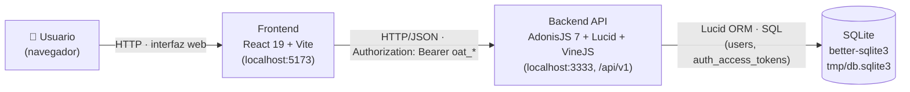
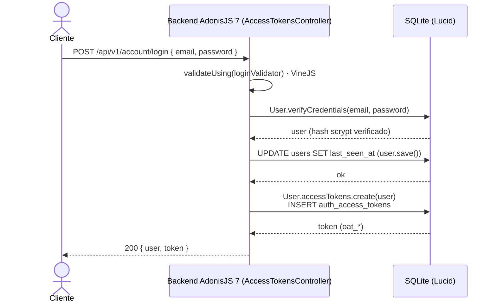

# full-stack-adonisjs-master

Starter kit full-stack con autenticación por **access tokens**. Repo hilo conductor
del máster **AI4Devs** (LIDR). Monorepo con backend y frontend independientes.

```
full-stack-adonisjs-master/
├── backend/      AdonisJS 7 + Lucid + SQLite + VineJS + @adonisjs/auth
├── frontend/     React 19 + Vite + React Router + Tailwind v4 + shadcn/ui
├── openspec/     Configuración de OpenSpec (flujo /opsx:*)
├── docs/         Documentación del producto (PRD.md, ADRs, diagramas)
├── CLAUDE.md     Memoria de proyecto para copilotos de IA
└── README.md
```

## Requisitos

- **Node.js 24** o superior (AdonisJS 7 lo requiere). Comprueba con `node -v`.
- npm 10+.

## Arranque rápido

### 1. Backend (`http://localhost:3333`)

```bash
cd backend
npm install
cp .env.example .env
node ace generate:key      # rellena APP_KEY en .env
npm run migration:run      # crea las tablas users + auth_access_tokens
npm run dev                # servidor con HMR
```

### 2. Frontend (`http://localhost:5173`)

```bash
cd frontend
npm install
cp .env.example .env       # VITE_API_URL ya apunta al backend
npm run dev
```

Abre `http://localhost:5173`, regístrate, entra al dashboard y cierra sesión.

## Endpoints del backend

| Método | Ruta | Auth | Descripción |
|---|---|---|---|
| GET | `/api/v1/health` | — | Liveness (`{ status: 'ok' }`) |
| POST | `/api/v1/account/register` | — | Registro → `{ user, token }` |
| POST | `/api/v1/account/login` | — | Login → `{ user, token }` |
| POST | `/api/v1/account/logout` | Bearer | Revoca el token actual |
| GET | `/api/v1/account/profile` | Bearer | Usuario autenticado |
| GET | `/api/v1/users` | Bearer | Lista de usuarios |
| GET | `/api/v1/users/:id` | Bearer | Usuario por id |

> El endpoint `GET /api/v1/users/active` se implementa en vivo en la Sesión 3.

## Arquitectura

### Diagrama de contexto (C4 nivel 1)

Cómo se conectan las piezas de FlowSync y la naturaleza de cada conexión.



### Secuencia del login

Flujo real de `POST /api/v1/account/login` (ver `backend/app/controllers/access_tokens_controller.ts`).



## Workflow con OpenSpec

Flujo spec-driven con Claude Code o Cursor:

```
/opsx:propose "añadir endpoint X"   # genera proposal + specs + tasks
/opsx:apply                          # implementa según las tasks
/opsx:archive                        # archiva el cambio aplicado
```

La configuración vive en `openspec/config.yaml`. Los comandos y skills se
instalaron en `.claude/` y `.cursor/`.

## Para el formador

Este repo representa el **estado de referencia tras las Sesiones 1 y 2**:
starter kit de auth (S1, Ejercicio 1) + OpenSpec inicializado y endpoint
`/health` (S2, Ejercicio 2). Es la base sobre la que se construyen las demos
de S3 en adelante. Las ramas de alumno siguen el patrón `alumno/nombre-apellido`.
